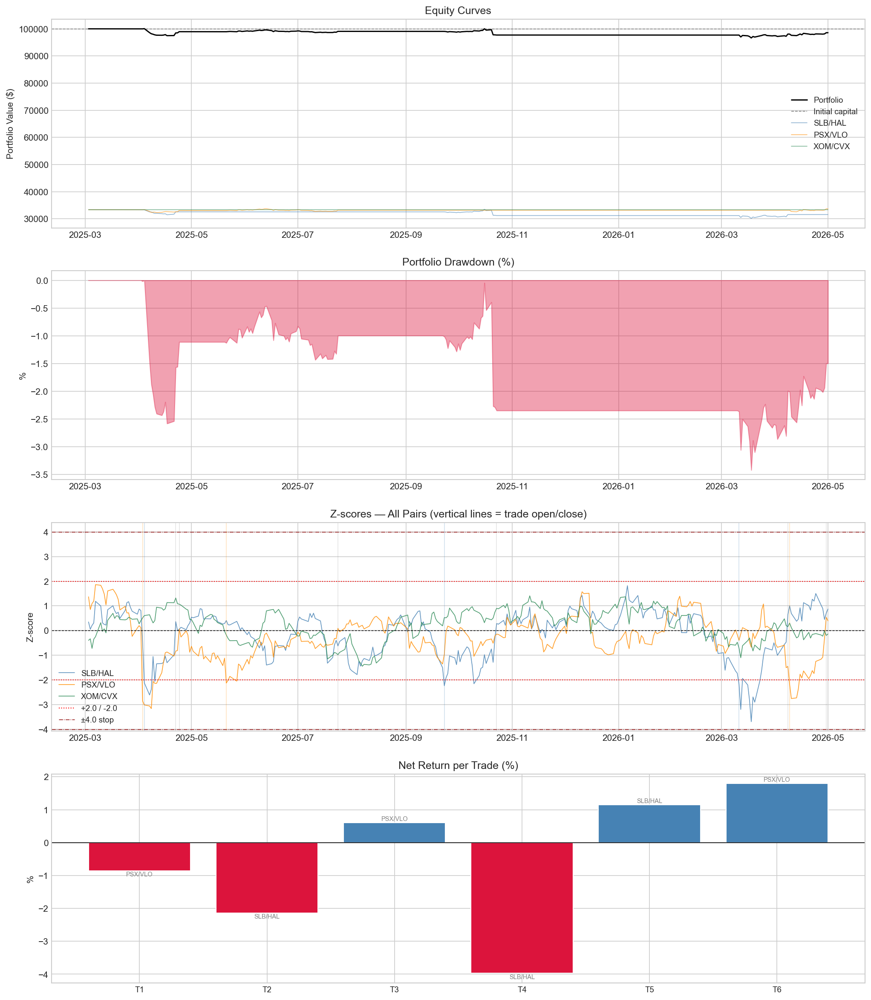
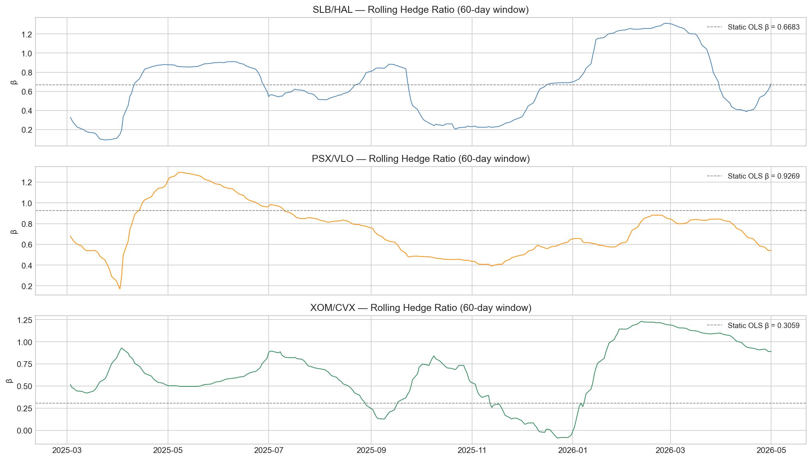

## Overview

We run a pairs trading strategy across three energy sector pairs simultaneously,
capturing relative value dislocations within the energy industry.

The three pairs span different parts of the energy value chain — all driven by
the same macro environment (oil prices, energy demand, capex cycles) but
reacting differently in the short term, creating tradeable spreads.

| Pair | Sub-sector | Economic link |
|------|-----------|---------------|
| **SLB / HAL** | Oilfield Services | Both serve upstream drillers; revenue tracks rig counts |
| **PSX / VLO** | Refining | Both earn on crack spread; same input/output |
| **XOM / CVX** | Integrated Majors | Largest US oil majors; same macro exposure |

**Formation period:** 2024-03-01 → 2025-03-01  
**Backtest period:** 2025-03-03 → 2026-05-01  
**Capital:** $100,000 split equally across 3 pairs (~$33,333 each)

---

## Pair Selection & Rationale

All three pairs share a core thesis: companies in the same sub-sector of energy
are exposed to the same macro drivers, so short-term price dislocations between
them tend to revert.

**SLB / HAL** — Schlumberger and Halliburton are the two largest oilfield
services companies globally. Both provide drilling, completion, and reservoir
services to the same customers. When one temporarily outperforms the other,
competitive dynamics pull the spread back.

**PSX / VLO** — Phillips 66 and Valero are pure-play refiners. Their margins
are entirely driven by the crack spread — the difference between crude oil input
cost and refined product prices. Same input, same output, same margin driver.

**XOM / CVX** — ExxonMobil and Chevron are the two largest US integrated oil
majors. Both produce, refine, and sell oil and gas globally. Their relative
valuation is driven by capital allocation and dividend policy, making the spread
mean-reverting over medium horizons.

---

## Statistical Validation

Cointegration was tested on the **formation period only** (2024-03-01 to
2025-03-01) — the data available before going live on March 1 2025.
No backtest data was used in parameter estimation.

| Pair | Correlation | EG p-value | ADF p-value | Hedge Ratio β | R² |
|------|------------|-----------|------------|--------------|-----|
| SLB/HAL | 0.9226 | 0.061 (10% ✓) | **0.040 (5% ✓)** | 0.6683 | 0.8549 |
| PSX/VLO | 0.9332 | 0.140 (marginal) | **0.048 (5% ✓)** | 0.9269 | 0.8708 |
| XOM/CVX | 0.3125 | 0.307 (marginal) | 0.132 | 0.3059 | 0.0977 |

SLB/HAL and PSX/VLO both pass the ADF test at the 5% level, confirming
mean-reverting spreads. XOM/CVX is statistically weaker but included for
portfolio breadth and strong economic rationale.

---

## Strategy Design

### Rolling OLS — Dynamic Hedge Ratio

Instead of fixing the hedge ratio at the formation-period OLS estimate, we
use a **60-day rolling OLS window** that updates every trading day. This lets
the strategy adapt as the relative valuation between the two companies shifts
over time.

The hedge ratio evolution is shown in the chart below — note how all three
pairs drift significantly from their static OLS estimates (dashed lines),
justifying the dynamic approach.

### Entry Rules

- **Long spread** (long A, short B): z-score drops below **−2.0**
- **Short spread** (short A, long B): z-score rises above **+2.0**

We chose ±2.0 because it is wide enough to filter out daily noise but still
occurs frequently enough to generate meaningful trades over a year-long backtest.

### Exit Rules

| Fate | Trigger | Interpretation |
|------|---------|---------------|
| **Mean reversion** | z-score crosses 0 | Spread returned to equilibrium |
| **Stop-loss** | \|z-score\| > 4.0 | Spread kept moving against us — cut loss |
| **End of backtest** | Position open at end | Force-closed at last price |

### Position Sizing

- ~$33,333 allocated per pair (dollar-neutral: ~$16,667 per leg)
- 5 bps transaction cost one-way (10 bps round-trip per trade)

---

## Results

### Performance Summary

| Metric | SLB/HAL | PSX/VLO | XOM/CVX | Portfolio |
|--------|---------|---------|---------|-----------|
| Total Return | -5.29% | +0.99% | 0.00% | -1.44% |
| Ann. Return | -4.55% | +0.84% | 0.00% | -1.23% |
| Sharpe Ratio | -0.501 | 0.198 | 0.000 | -0.351 |
| Max Drawdown | -10.08% | -3.42% | 0.00% | -3.42% |
| Win Rate | 33.3% | 66.7% | — | 50.0% |
| Avg Hold (days) | 25.3 | 35.3 | — | 30.3 |
| Total Trades | 3 | 3 | 0 | 6 |
| Stop-loss Exits | 0 | 0 | 0 | 0 |
| Exp. Return/Trade | -1.657% | +0.514% | — | -0.571% |

### Equity Curves & Drawdown

### Rolling Hedge Ratio Evolution

---

## Trade Log

| # | Pair | Open | Close | Direction | Entry Z | Exit Z | Days | Net Return | Fate |
|---|------|------|-------|-----------|---------|--------|------|-----------|------|
| 1 | PSX/VLO | 2025-04-03 | 2025-04-24 | Long spread | -2.856 | 0.064 | 21 | -0.85% | Mean reversion |
| 2 | SLB/HAL | 2025-04-04 | 2025-04-22 | Long spread | -2.126 | 0.361 | 18 | -2.15% | Mean reversion |
| 3 | PSX/VLO | 2025-05-21 | 2025-07-24 | Long spread | -2.131 | 0.089 | 64 | +0.60% | Mean reversion |
| 4 | SLB/HAL | 2025-09-23 | 2025-10-23 | Long spread | -2.239 | 0.283 | 30 | -3.97% | Mean reversion |
| 5 | SLB/HAL | 2026-03-11 | 2026-04-08 | Long spread | -2.181 | 0.636 | 28 | +1.15% | Mean reversion |
| 6 | PSX/VLO | 2026-04-09 | 2026-04-30 | Long spread | -2.175 | 0.537 | 21 | +1.79% | Mean reversion |

---

## Strategy Health Monitoring

### How do we know the strategy is performing as expected?

We track the **rolling 60-day Sharpe ratio**. If it drops significantly below
the backtest Sharpe, that signals underperformance. We also monitor the
z-score distribution — if z-scores rarely cross 0 (the spread keeps widening
instead of reverting), cointegration may have broken down.

### How do we know when the strategy stops working?

Two clear signals:

1. **Stop-loss rate exceeds 50%** of all trades — the spread is trending against
   us more often than not
2. **Rolling hedge ratio drifts more than 30%** from its formation-period
   estimate — the fundamental relationship between the two companies has changed

At that point we re-run the screener on a fresh formation window and either
update the parameters or switch pairs.

---

## Discussion

### What the results tell us

All 6 trades were **long spread** (z-score < -2.0), meaning the spread was
consistently below its historical mean during the backtest period. This
systematic one-sided signal suggests the spread had a directional drift rather
than pure mean reversion — a sign of potential cointegration breakdown or a
structural shift in relative valuation.

SLB/HAL was the main drag. The rolling hedge ratio chart shows the ratio
drifted significantly from its formation estimate, particularly during
mid-2025 and early 2026, which contributed to noisy z-score signals.

PSX/VLO performed best, consistent with its stronger ADF result in the
formation period. XOM/CVX generated zero trades — its z-score never crossed
±2.0, suggesting the spread remained within normal range throughout the
backtest.

Importantly, **all trades exited via mean reversion** with zero stop-loss
triggers. This confirms the spread does eventually revert, but entry timing
was unfavorable for several trades.

### Risks

- **Sector concentration:** All three pairs are in energy — a sector-wide
  shock could blow out all three spreads simultaneously
- **Weak cointegration:** XOM/CVX failed statistical tests — highest risk pair
- **Systematic spread drift:** All trades were long spread, suggesting
  directional bias rather than pure mean reversion
- **Small sample:** 6 trades over 294 days is insufficient for strong
  statistical conclusions

### How to improve

- Add pairs from other sectors to reduce energy concentration risk
- Use a regime filter (e.g. avoid trading when VIX > 25)
- Implement partial exits at z = 0.5 to lock in profits earlier
- Re-run formation period annually to keep parameters current
- Increase rolling window from 60 to 90 days for more stable hedge ratios

---

## Code

Full source code available in the
[GitHub repository](https://github.com).
The main notebook `pairs_trading.ipynb` connects to IBKR via ShinyBroker
to fetch historical data, runs the backtest, and generates `trades.csv`
and `ledger.csv`.

---

## Strategy Monitoring

### How will we know the strategy is performing as expected?

We track three metrics on a rolling 30-day basis after going live:

1. **Rolling Sharpe ratio** — if it drops below −0.5 (our backtest benchmark),
   the strategy is underperforming expectations. We give it one full month before
   making any changes to avoid reacting to noise.

2. **Z-score crossing rate** — we expect the z-score to cross 0 roughly as often
   as it crossed 0 during the formation period. If the spread goes more than
   60 consecutive days without crossing 0, the spread is trending rather than
   mean-reverting — a sign cointegration has weakened.

3. **Trade direction balance** — during the backtest, all 6 trades were long
   spread. Going forward, if we see more than 80% of trades in the same
   direction over a 3-month window, it signals a systematic drift in the spread
   rather than random mean reversion.

### How will we quantify when the strategy stops working?

We define two hard stop conditions:

1. **Stop-loss rate exceeds 50%** over any rolling 10-trade window — the spread
   is consistently moving against us, meaning the mean-reversion assumption has
   broken down.

2. **Rolling hedge ratio drifts more than 40% from the formation-period
   estimate** — for example, if the SLB/HAL hedge ratio was 0.668 at formation
   and the 60-day rolling estimate moves above 0.935 or below 0.401, we treat
   the structural relationship as changed.

If either condition is triggered, we stop trading, re-run the screener on a
fresh 12-month formation window, and re-validate the pairs before resuming.
